# Utility Scripts

This directory contains utility scripts for testing, debugging, and scaling operations for the MotherDuck benchmark project. These scripts were created to address specific challenges encountered during development and benchmarking.

## Table of Contents
- [Connection & Testing Scripts](#connection--testing-scripts)
- [Scaling Scripts](#scaling-scripts)
- [SQL Scripts for Manual Execution](#sql-scripts-for-manual-execution)
- [System Investigation Scripts](#system-investigation-scripts)

---

## Connection & Testing Scripts

### test_motherduck_connection.py

**Purpose**: Test and validate MotherDuck connection with various approaches

**Why we made it**: During initial setup, users often encounter connection issues due to DuckDB version incompatibilities or authentication problems. This script helps diagnose and resolve these issues.

**Features**:
- Loads MotherDuck token from environment or .env file
- Attempts connection with `FORCE INSTALL motherduck` extension
- Tests basic query execution
- Shows DuckDB version information
- Falls back to alternative connection methods if primary fails

**Usage**:
```bash
python scripts/test_motherduck_connection.py
```

**When to use**:
- First-time setup validation
- After upgrading/downgrading DuckDB
- When encountering "DuckDB version not supported" errors
- Debugging authentication issues

### test_explain.py

**Purpose**: Debug and understand DuckDB's EXPLAIN output format

**Why we made it**: The main benchmark script has an `--explain` flag to show query plans. We needed to understand DuckDB's EXPLAIN output structure (key-value tuples with ASCII tree visualization) to properly display it.

**Features**:
- Tests both `EXPLAIN` and `EXPLAIN ANALYZE` output
- Shows the structure of explain results (key-value tuples)
- Displays the ASCII tree visualization of query plans
- Demonstrates how to parse the explain_key and explain_value columns

**Usage**:
```bash
python scripts/test_explain.py
```

**When to use**:
- Understanding query optimization
- Debugging performance issues
- Learning DuckDB's query plan format

---

## Scaling Scripts

### scale_further.py

**Purpose**: Scale an already-scaled table by a multiplication factor

**Why we made it**: The main script's `--scale-table` starts from the 240k base table. When building incrementally (e.g., scaling from 2.4B to 24B), starting over is inefficient.

**Features**:
- Works with existing scaled tables (not starting from scratch)
- Shows current and target row counts
- Provides warnings for very large operations (>10B rows)
- Replaces the original table atomically

**Usage**:
```bash
# Scale current table by 10x
python scripts/scale_further.py 10
```

**When to use**:
- Incremental scaling (e.g., 240M → 2.4B → 24B)
- Testing different scale factors without starting over
- When you've already partially scaled and want to continue

### scale_to_24b.py

**Purpose**: Scale from exactly 19.2B rows to 24B rows

**Why we made it**: During benchmarking, we had 19.2B rows and needed exactly 24B. This script adds precisely 4.8B rows.

**Features**:
- Calculates exact rows needed
- Creates temporary 4.8B row table
- Uses UNION ALL for efficient combination
- Progress tracking with timing
- Automatic cleanup on error

**Usage**:
```bash
python scripts/scale_to_24b.py
```

**When to use**:
- Final scaling step to reach exactly 24B rows
- When you have 19.2B and need to reach the benchmark target

### scale_with_union.py

**Purpose**: Scale tables using UNION ALL instead of CROSS JOIN

**Why we made it**: CROSS JOIN creates Cartesian products that explode memory usage. UNION ALL is much more memory-efficient for large-scale operations.

**Features**:
- Two strategies: recursive (doubling) and iterative
- Recursive: 1x → 2x → 4x → 8x (efficient for powers of 2)
- Iterative: Builds with single UNION ALL query
- Shows progress and timing

**Usage**:
```bash
# Recursive strategy (default)
python scripts/scale_with_union.py 10 recursive

# Iterative strategy
python scripts/scale_with_union.py 10 iterative
```

**When to use**:
- When CROSS JOIN causes memory/timeout issues
- Scaling by powers of 2 (use recursive)
- Need more control over memory usage

### optimized_scale_to_24b.py

**Purpose**: Efficiently scale to 24B rows by building a reusable 1B row temp table

**Why we made it**: Previous incremental approaches rebuilt temp tables from scratch for each batch, wasting time. This optimized version builds a 1B row table ONCE and reuses it for all insertions.

**Features**:
- Checks current table size and calculates exact batches needed
- **Rounding Phase**: Automatically rounds current row count to nearest billion
  - If not on billion boundary, adds rows to reach next billion
  - Example: 11.976B → adds 24M rows → 12B
- **Temp Table Reuse**: Builds 1B row temp table once using progressive UNION ALL
  - 10x (2.4M) → 100x (24M) → 1000x (240M) → 1B
  - Checks if temp_1b already exists and reuses it
- **Batch Insertion**: Reuses the same 1B table for all insertions
- 15-second cooldown between batches (prevents timeouts)
- Option to keep temp_1b table for future scaling operations
- Progress tracking with timestamps and percentages

**Usage**:
```bash
python scripts/optimized_scale_to_24b.py
```

**Workflow Diagram**:

```mermaid
flowchart TD
    Start([Start]) --> Connect[Connect to MotherDuck]
    Connect --> Check[Check current table size]

    Check --> IsTarget{Current >= 24B?}
    IsTarget -->|Yes| Done([Done - Already at target])
    IsTarget -->|No| CheckBillion{On billion boundary?}

    CheckBillion -->|No| Round[Round to nearest billion]
    Round --> CreateSmall[Create small temp table]
    CreateSmall --> InsertRound[Insert rounding rows]
    InsertRound --> CleanRound[Drop temp_round]
    CleanRound --> CalcBatches

    CheckBillion -->|Yes| CalcBatches[Calculate billions needed]

    CalcBatches --> CheckTemp{temp_1b exists?}
    CheckTemp -->|Yes| VerifySize{Size = 1B?}
    VerifySize -->|No| DropOld[Drop old temp_1b]
    DropOld --> Build1B
    VerifySize -->|Yes| StartLoop

    CheckTemp -->|No| Build1B[Build 1B table progressively]

    Build1B --> Build10x[Build temp_10x: 2.4M rows]
    Build10x --> Build100x[Build temp_100x: 24M rows]
    Build100x --> Build1000x[Build temp_1000x: 240M rows]
    Build1000x --> BuildFinal[Build temp_1b: 1B rows]
    BuildFinal --> CleanIntermediate[Clean intermediate tables]

    CleanIntermediate --> StartLoop[Start insertion loop]

    StartLoop --> InsertBatch[Insert 1B from temp_1b]
    InsertBatch --> UpdateCount[Update row count]
    UpdateCount --> MoreBatches{More batches needed?}

    MoreBatches -->|Yes| Cooldown[Wait 15 seconds]
    Cooldown --> InsertBatch

    MoreBatches -->|No| KeepTemp{Keep temp_1b?}
    KeepTemp -->|Yes| UpdateView
    KeepTemp -->|No| DropTemp[Drop temp_1b]
    DropTemp --> UpdateView[Update view]

    UpdateView --> FinalStats[Show final statistics]
    FinalStats --> End([End])

    style Start fill:#e1f5e1
    style Done fill:#e1f5e1
    style End fill:#e1f5e1
    style Round fill:#fff3cd
    style Build1B fill:#cfe2ff
    style InsertBatch fill:#d1ecf1
    style Cooldown fill:#f8d7da
```


**When to use**:
- Scaling to 24B rows from any starting point
- When you need the most efficient scaling approach
- Want to reuse temp tables for future operations
- Need to minimize MotherDuck compute time
- Have non-billion row counts that need rounding first

---

## SQL Scripts for Manual Execution

### simple_union_scale.sql

**Purpose**: Simplified UNION ALL scaling with two options

**Why we made it**: Provides flexibility for different memory constraints.

**Options**:
1. **Smaller chunks**: 600M per batch, insert 24 times (less memory)
2. **Larger chunks**: 1.2B per batch, insert 12 times (fewer operations)

**Usage**: Choose option based on available memory, execute in UI

### scale_to_24b.sql

**Purpose**: Direct SQL to scale from 19.2B to exactly 24B rows

**Why we made it**: Simple SQL alternative to the Python script for the final scaling step.

**Features**:
- Creates 4.8B row temporary table (240k × 20,000)
- Combines with existing 19.2B using UNION ALL
- Atomic table replacement
- View update included

---

## Common Issues and Solutions

### Timeout Errors
**Issue**: "Your request timed out, the MotherDuck servers took too long"
**Solution**: Use incremental scaling scripts with cooldown periods

### Memory Issues
**Issue**: Running out of temp disk space
**Solution**: Switch from CROSS JOIN to UNION ALL based scripts

### Version Incompatibility
**Issue**: "Your DuckDB version is not yet supported by MotherDuck"
**Solution**: Use `test_motherduck_connection.py` to diagnose, downgrade DuckDB if needed

### Phantom Views
**Issue**: System views showing errors in `--show-tables` (database_snapshots, storage_info, etc.)
**Solution**: These are now excluded in the main script. Do NOT try to access these views directly as they will cause hanging queries that can't be killed

---

## Best Practices

1. **Always use UNION ALL for large-scale operations** - More memory efficient than CROSS JOIN
2. **Add cooldown periods** - Prevents MotherDuck timeout errors
3. **Scale incrementally** - Easier to recover from failures
4. **Monitor progress** - Use scripts with progress tracking for large operations
5. **Test connection first** - Run `test_motherduck_connection.py` before large operations

---

## Adding New Scripts

When adding new utility scripts:

1. Follow the existing naming convention (snake_case.py)
2. Include a docstring explaining purpose
3. Handle .env file loading consistently
4. Provide clear error messages
5. Make executable: `chmod +x scripts/your_script.py`
6. Update this README with:
   - Purpose and why it was created
   - Features and usage
   - When to use it
   - Any warnings or limitations