# Utility Scripts

This directory contains utility scripts for testing, debugging, and scaling operations for the MotherDuck benchmark project. These scripts were created to address specific challenges encountered during development and benchmarking.

## Table of Contents
- [Connection & Testing Scripts](#connection--testing-scripts)
- [Scaling Scripts](#scaling-scripts)
- [SQL Scripts for Manual Execution](#sql-scripts-for-manual-execution)
- [System Investigation Scripts](#system-investigation-scripts)

---

## Connection & Testing Scripts

### test_motherduck_connection.py

**Purpose**: Test and validate MotherDuck connection with various approaches

**Why we made it**: During initial setup, users often encounter connection issues due to DuckDB version incompatibilities or authentication problems. This script helps diagnose and resolve these issues.

**Features**:
- Loads MotherDuck token from environment or .env file
- Attempts connection with `FORCE INSTALL motherduck` extension
- Tests basic query execution
- Shows DuckDB version information
- Falls back to alternative connection methods if primary fails

**Usage**:
```bash
python scripts/test_motherduck_connection.py
```

**When to use**:
- First-time setup validation
- After upgrading/downgrading DuckDB
- When encountering "DuckDB version not supported" errors
- Debugging authentication issues

### test_explain.py

**Purpose**: Debug and understand DuckDB's EXPLAIN output format

**Why we made it**: The main benchmark script has an `--explain` flag to show query plans. We needed to understand DuckDB's EXPLAIN output structure (key-value tuples with ASCII tree visualization) to properly display it.

**Features**:
- Tests both `EXPLAIN` and `EXPLAIN ANALYZE` output
- Shows the structure of explain results (key-value tuples)
- Displays the ASCII tree visualization of query plans
- Demonstrates how to parse the explain_key and explain_value columns

**Usage**:
```bash
python scripts/test_explain.py
```

**When to use**:
- Understanding query optimization
- Debugging performance issues
- Learning DuckDB's query plan format

---

## Scaling Scripts

> **Note**: We've consolidated all Python scaling functionality into `optimized_scale_to_24b.py` which supersedes 5 previous scripts (scale_further.py, scale_to_24b.py, scale_with_union.py, incremental_scale_to_24b.py, scale_to_24b.sql). This single script handles all scaling scenarios efficiently with UNION ALL, temp table reuse, and automatic rounding. For SQL-only users, `simple_union_scale.sql` provides a manual alternative.

### optimized_scale_to_24b.py

**Purpose**: Efficiently scale to EXACTLY 24B rows with precise row counting and optimized table building

**Why we made it**: Previous incremental approaches rebuilt temp tables from scratch for each batch, wasting time. This optimized version builds a 1B row table ONCE and reuses it for all insertions, with precision adjustments to reach exactly 24B rows.

**Features**:
- Checks current table size and calculates exact batches needed
- **Rounding Phase**: Automatically rounds current row count to nearest billion
  - If not on billion boundary, adds rows to reach next billion
  - Example: 11.976B → adds 24M rows → 12B
  - For large adjustments (e.g., 192M for 23.808B→24B), uses optimized progressive building
- **Precise 1B Table**: Builds temp_1b with EXACTLY 1,000,000,000 rows
  - 960M base (4×240M) + 40M precise addition (166×240k + 160k using LIMIT)
  - Verifies exact count and rebuilds if existing temp_1b isn't exactly 1B
- **Batch Insertion**: Reuses the same 1B table for all insertions
- **Final Precision Adjustment**: After billion-row batches, adds exact remaining rows
  - Calculates shortfall and builds precise adjustment table
  - Uses LIMIT for partial rows when needed
- 15-second cooldown between batches (prevents timeouts)
- Option to keep temp_1b table for future scaling operations
- Progress tracking with timestamps and percentages

**Optimization for Large Multipliers**:
- For 192M rows (800×240k), uses 3-step progressive building instead of 800 iterations:
  - 10x (2.4M) → 100x (24M) → 800x (192M)
  - Exponentially faster than iterative approach

**Usage**:
```bash
python scripts/optimized_scale_to_24b.py
```

**Workflow Diagram**:

```mermaid
flowchart TD
    Start([Start]) --> Connect[Connect to MotherDuck]
    Connect --> Check[Check current table size]

    Check --> IsTarget{Current >= 24B?}
    IsTarget -->|Yes| Done([Done - Already at target])
    IsTarget -->|No| CheckBillion{On billion boundary?}

    CheckBillion -->|No| Round[Round to nearest billion]
    Round --> CheckLarge{Large adjustment?>100M?}
    CheckLarge -->|Yes| Optimized[Optimized progressive build<br/>10x→100x→800x]
    CheckLarge -->|No| CreateSmall[Create rounding table]
    Optimized --> InsertRound
    CreateSmall --> InsertRound[Insert rounding rows]
    InsertRound --> CleanRound[Drop temp_round]
    CleanRound --> CalcBatches

    CheckBillion -->|Yes| CalcBatches[Calculate billions needed]

    CalcBatches --> NeedBatches{Billions needed > 0?}
    NeedBatches -->|No| FinalPrecision
    NeedBatches -->|Yes| CheckTemp{temp_1b exists?}

    CheckTemp -->|Yes| VerifySize{Size exactly 1B?}
    VerifySize -->|No| DropOld[Drop old temp_1b]
    DropOld --> Build1B
    VerifySize -->|Yes| StartLoop

    CheckTemp -->|No| Build1B[Build PRECISE 1B table]

    Build1B --> Build10x[Build 10x: 2.4M rows]
    Build10x --> Build100x[Build 100x: 24M rows]
    Build100x --> Build1000x[Build 1000x: 240M rows]
    Build1000x --> Build960M[Build 4×240M = 960M]
    Build960M --> Add40M[Add 166×240k + 160k LIMIT]
    Add40M --> VerifyExact[Verify exactly 1B rows]
    VerifyExact --> CleanIntermediate[Clean intermediate tables]

    CleanIntermediate --> StartLoop[Start insertion loop]

    StartLoop --> InsertBatch[Insert 1B from temp_1b]
    InsertBatch --> UpdateCount[Update row count]
    UpdateCount --> MoreBatches{More batches needed?}

    MoreBatches -->|Yes| Cooldown[Wait 15 seconds]
    Cooldown --> InsertBatch

    MoreBatches -->|No| FinalPrecision[Final precision check]

    FinalPrecision --> NeedAdjust{Need adjustment<br/>to reach exactly 24B?}
    NeedAdjust -->|Yes| CalcAdjust[Calculate exact shortfall]
    CalcAdjust --> BuildAdjust[Build adjustment table<br/>with LIMIT if needed]
    BuildAdjust --> InsertAdjust[Insert final adjustment]
    InsertAdjust --> Cleanup

    NeedAdjust -->|No| Cleanup[Cleanup phase]

    Cleanup --> KeepTemp{Keep temp_1b?}
    KeepTemp -->|Yes| UpdateView
    KeepTemp -->|No| DropTemp[Drop temp_1b]
    DropTemp --> UpdateView[Update view]

    UpdateView --> FinalStats[Show final statistics<br/>EXACTLY 24B achieved!]
    FinalStats --> End([End])

    style Start fill:#e1f5e1
    style Done fill:#e1f5e1
    style End fill:#e1f5e1
    style Round fill:#fff3cd
    style Build1B fill:#cfe2ff
    style Add40M fill:#ffcccc
    style FinalPrecision fill:#ffcccc
    style BuildAdjust fill:#ffcccc
    style InsertBatch fill:#d1ecf1
    style Cooldown fill:#f8d7da
    style Optimized fill:#fff3cd
```


**When to use**:
- Scaling to 24B rows from any starting point
- When you need the most efficient scaling approach
- Want to reuse temp tables for future operations
- Need to minimize MotherDuck compute time
- Have non-billion row counts that need rounding first

---

## SQL Scripts for Manual Execution

### simple_union_scale.sql

**Purpose**: Simplified UNION ALL scaling with two options

**Why we made it**: Provides flexibility for different memory constraints.

**Options**:
1. **Smaller chunks**: 600M per batch, insert 24 times (less memory)
2. **Larger chunks**: 1.2B per batch, insert 12 times (fewer operations)

**Usage**: Choose option based on available memory, execute in UI


---

## Common Issues and Solutions

### Timeout Errors
**Issue**: "Your request timed out, the MotherDuck servers took too long"
**Solution**: Use `optimized_scale_to_24b.py` with built-in cooldown periods

### Memory Issues
**Issue**: Running out of temp disk space
**Solution**: Switch from CROSS JOIN to UNION ALL based scripts

### Version Incompatibility
**Issue**: "Your DuckDB version is not yet supported by MotherDuck"
**Solution**: Use `test_motherduck_connection.py` to diagnose, downgrade DuckDB if needed

### Phantom Views
**Issue**: System views showing errors in `--show-tables` (database_snapshots, storage_info, etc.)
**Solution**: These are now excluded in the main script. Do NOT try to access these views directly as they will cause hanging queries that can't be killed

---

## Best Practices

1. **Always use UNION ALL for large-scale operations** - More memory efficient than CROSS JOIN
2. **Add cooldown periods** - Prevents MotherDuck timeout errors
3. **Scale incrementally** - Easier to recover from failures
4. **Monitor progress** - Use scripts with progress tracking for large operations
5. **Test connection first** - Run `test_motherduck_connection.py` before large operations

---

## Current Script Inventory

After consolidation, we maintain a minimal set of 4 essential scripts:

| Script | Type | Purpose |
|--------|------|---------|
| `test_motherduck_connection.py` | Testing | Validate MotherDuck connection & diagnose issues |
| `test_explain.py` | Testing | Debug DuckDB EXPLAIN output format |
| `optimized_scale_to_24b.py` | Scaling | Comprehensive scaling solution (replaces 5 scripts) |
| `simple_union_scale.sql` | Scaling | SQL-only alternative for UI users |

### Scripts Consolidated/Removed

The following scripts were removed as `optimized_scale_to_24b.py` provides superior functionality:
- ~~`scale_further.py`~~ - Used inefficient CROSS JOIN
- ~~`scale_to_24b.py`~~ - Used CROSS JOIN, too specific
- ~~`scale_with_union.py`~~ - Features integrated into optimized version
- ~~`incremental_scale_to_24b.py`~~ - Inefficiently rebuilt temp tables
- ~~`scale_to_24b.sql`~~ - CROSS JOIN based, narrow use case
- ~~`investigate_views.py`~~ - Caused hanging queries
- ~~`check_views.py`~~ - Also caused hanging queries

## Adding New Scripts

When adding new utility scripts:

1. Follow the existing naming convention (snake_case.py)
2. Include a docstring explaining purpose
3. Handle .env file loading consistently
4. Provide clear error messages
5. Make executable: `chmod +x scripts/your_script.py`
6. Update this README with:
   - Purpose and why it was created
   - Features and usage
   - When to use it
   - Any warnings or limitations
7. Consider if functionality could be added to existing scripts instead